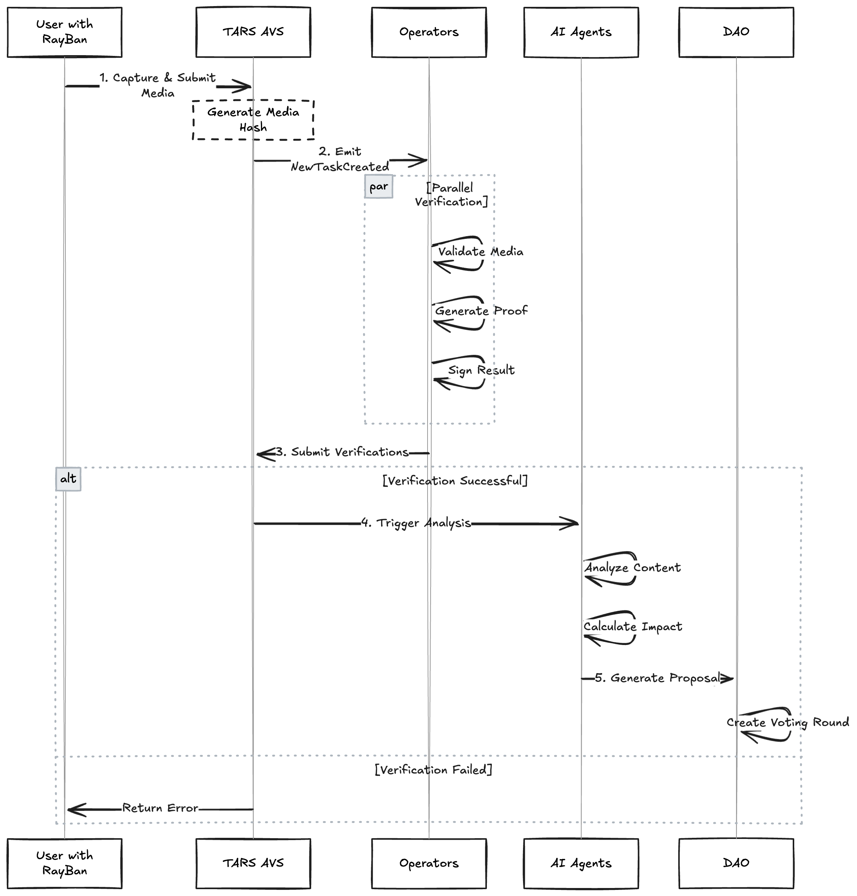
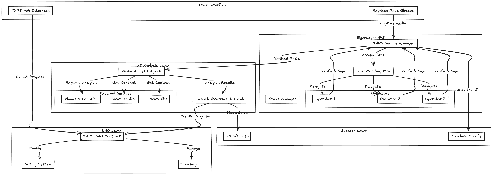

# TARS AVS (Transformative Action Recognition System)

## Architecture





### AVS User Flow

1) User captures media through Ray-Ban Meta glasses and submits for verification
2) TARS AVS contract receives the media hash and metadata, emitting a NewTaskCreated event
3) Registered operators with staked assets process the verification request:
   - Validate media authenticity
   - Generate cryptographic proof
   - Sign the verification result
4) Operators submit their signed verifications to the TARS AVS contract
5) Once sufficient operators verify the media, it's marked as authenticated and proceeds to AI analysis

## Local Development Setup

### Prerequisites
- Node.js & npm
- Typescript & ts-node
- Foundry
- ethers.js
- Claude Vision API key
- Pinata API key
- OpenWeatherMap API key
- NewsAPI key

### Quick Start

1. **Start Local Chain**
```bash
# Install dependencies
npm install

# Start local anvil chain
npm run start:anvil
```

2. **Deploy Contracts & Start Operator**
```bash
# Setup environment
cp .env.example .env
cp contracts/.env.example contracts/.env

# Build contracts
npm run build

# Deploy EigenLayer core
npm run deploy:core

# Deploy TARS AVS contracts
npm run deploy:image-verification

# Start operator
npm run start:image-verification-operator
```

3. **Test Media Verification**
```bash
# Start the test client
npm run start:image-verification-traffic"
```

### Environment Configuration

Required variables in `.env`:
```
ANTHROPIC_API_KEY=           # For Claude Vision
PINATA_JWT=                  # For IPFS storage
OPEN_WEATHER_API_KEY=        # For weather data
NEWS_API_KEY=                # For news context
EIGENLAYER_RPC_URL=         # Your RPC endpoint
OPERATOR_PRIVATE_KEY=        # Operator key
SERVICE_MANAGER_ADDRESS=     # Deployed service manager
USED IN THE AGENT CODE
```


